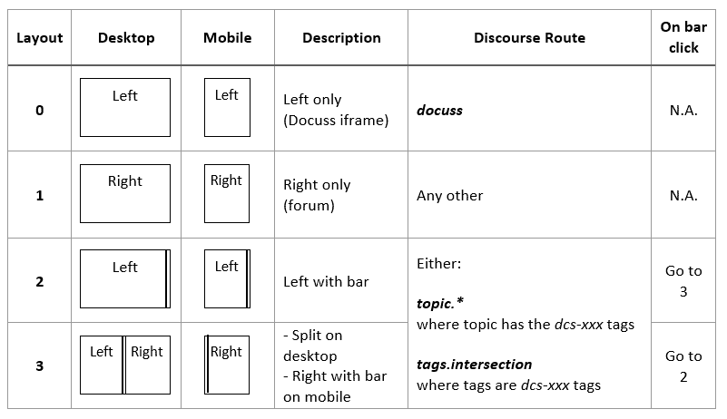

# comToPlugin.js

## Setup

Install with:

```
npm i dcs-client
```

## Initialization

```javascript
import { comToPlugin, inIFrame } from 'dcs-client'

if (inIFrame()) {
  comToPlugin.connect({
    discourseOrigin: '*',
    timeout: 10000,
    onTimeout: () => console.log('Could not connect to the Docuss plugin')
  })
}
```

## Possible layouts



## Change the Discourse route

```javascript
/**
 * A Route is defined by a layout and a Discourse url.
 * The Discourse url is computed either from (pageName, interactMode,
 * triggerId) or from (pathname)
 * @typedef {Object} Route
 * @property {(0|1|2|3)} layout
 * @property {String} [pageName] - Only if layout=1|2|3
 * @property {('COMMENT'|'DISCUSS')} [interactMode] - Only if layout=2|3
 * @property {String} [triggerId] - Only if layout=2|3
 * @property {String} [pathname] - Only if layout=1
 */

/**
 * @typedef {Object} SetRouteParams
 * @property {Route} route
 * @property {('PUSH'|'REPLACE')} mode
 * @property {*} clientContext
 */

// Go to the Docuss page called "home"
comToPlugin.postSetDiscourseRoute({
  route: { layout: 0, pageName: 'home' },
  mode: 'PUSH'
})

// Go to the split screen with:
// - on the left, the Docuss page called "whitep" with heading
// "heading09" selected
// - on the right, the Discourse tags intersection page corresponding to tags
// dcs-discuss and dcs-whitep-heading09
comToPlugin.postSetDiscourseRoute({
  route: {
    layout: 3,
    pageName: 'whitep',
    interactMode: 'DISCUSS',
    triggerId: 'heading09'
  },
  mode: 'PUSH'
})

// Go to Discourse "badges" page
comToPlugin.postSetDiscourseRoute({
  route: { layout: 1, pathname: '/badges' },
  mode: 'PUSH',
  clientContext: { foo: 'user-defined data here' }
})
```

## Set the route properties

Just after you've changed the route with `postSetDiscourseRoute()`, you can set some route properties using the following function: 

```javascript
/**
 * @typedef  {Object} RouteProps
 * @property {String} [category] - The name of an existing Discourse category, 
 * which will be set if the user creates a topic from the route
 * @property {String} [discourseTitle] - A text that will be displayed at the 
 * top of the Discourse page
 * @property {String} [error] - An error message that will be displayed instead 
 * of the website page.
 */
/**
 * @param {RouteProps} props
 */
postSetRouteProps({ 
  category: 'DocussTopic', 
  discourseTitle: 'Discussions about the selected car' 
})
```

You can see an example of `discourseTitle` [here](http://www.docuss.org/tags/intersection/dcs-discuss/dcs-lastev-stories) ("Stories").

## Set redirects

A redirect is a rule that tells Docuss, when it is about to transition to a certain route (called the "source" route"), to transition to another route instead (called the "destination" route").

### Allow comments/discussions on full pages

By default, a page doesn't display the split bar until you call
`postSetDiscourseRoute()` with layout=2 or 3. Indeed, the canonical Docuss usage
is to have a page containing clickable elements (balloons, buttons, menu
items...) that open the comments/discussions panel.

However, you might also want to have no clickable elements and have
comments/discussions enabled for the entire page. This emulates traditional
comment systems. You can do it like this:

```javascript
comToPlugin.postSetRedirects([
  {
    src: { layout: 0, pageName: 'home' },
    dest: { layout: 3, pageName: '@SAME_AS_SRC@' }
  }
])
```

The above disables layout 0 on the page called _home_, so that the page always
shows the split bar.

If you omit `pageName`, layout 0 is disabled on any page.

### Auto-hide the split bar when closing the right panel

By default, when you click the split bar to close the right panel, the panel
collapses but the split bar remains visible. This is useful when
comments/discussions are attached to a selectable clickable element (think a
highlighted heading).

However, when a clickable element has no selected state, you might want the
split bar to disappear when closing the right panel. You can do it like this:

```javascript
comToPlugin.postSetRedirects([
  {
    src: { layout: 2, pageName: 'home', triggerId: 'info' },
    dest: { layout: 0, pageName: '@SAME_AS_SRC@' }
  }
])
```

The above disables layout 2 on the page called _home_ for trigger _info_.

You can omit `pageName` and/or `triggerId` to target more than one page.

## Browser usage

[under construction]
